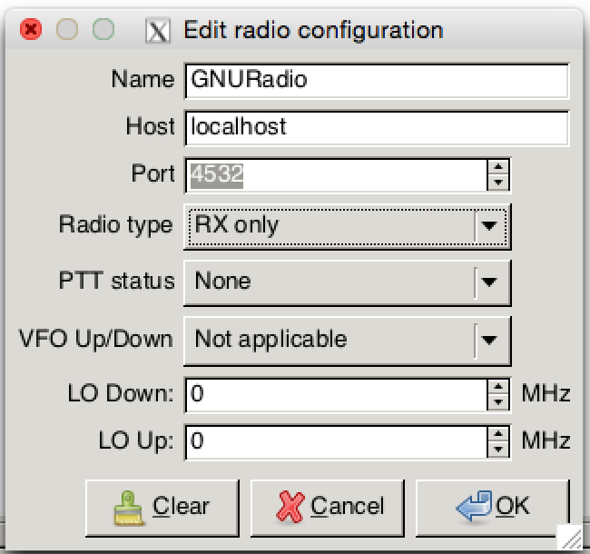
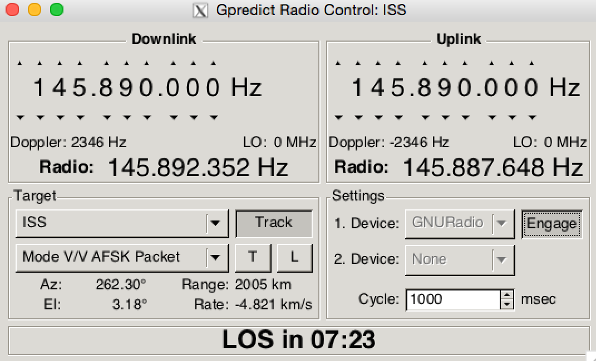

gr-gpredict-doppler
===================
Python block that updates a GNU Radio variable with the absolute frequency
as provided by [Gpredict](http://gpredict.oz9aec.net). This allows for Doppler shift corrected reception
of satellite signals.

Installation
------------

	mkdir build
	cd build
	cmake ../
	make
	sudo make install

Note: If you are running MacPorts you might need to change the installation
path. Use something like this: `cmake -DCMAKE_INSTALL_PREFIX=/opt/local ../`

License
-------
Apache License, Version 2.0

Basics
------
The Gpredict Doppler block updates a variable that you define with the absolute
center frequency including the current Doppler shift. This information is provided
from Gpredict according to your ground station settings.

Setting up Gpredict
-------------------
We are not covering the set up of Ground Stations, etc. in Gpredict but only the
dummy Radio we use to provide the frequency and doppler data to GNU Radio.
For information on setting up Gpredict and general use please read their [manual](http://gpredict.oz9aec.net/documents.php).

1. Open the Preferences dialog (_Edit -> Preferences_)
2. Switch to the _Interfaces_ section
3. Add a new Radio and enter the following settings:
   
4. Finish setting up your satellite and ground station according to the Gpredict manual

Usage
-----
1. To send Doppler frequency data to your flowgraph open the _Radio Control_ panel
2. Make sure your target satellite is selected and then enable the _Track_ feature
3. When you hit the _Engage_ button Gpredict will connect to your flowgraph and send frequency data
   
4. To debug the block set it into Verbose mode in GNU Radio Companion

Notes
-----
The provided flowgraph uses a Cosine wave mixed with the signal to correct the Doppler shift in software.
You could update the center frequency straight in your hardware source. Depending on your hardware this
could cause undesired spurious signals during the re-tuning and acquiring the PLL. It is better to capture
the whole bandwidth within which the signal will shift and then mix it in software. This prevents excessive
re-tuning of your hardware.
